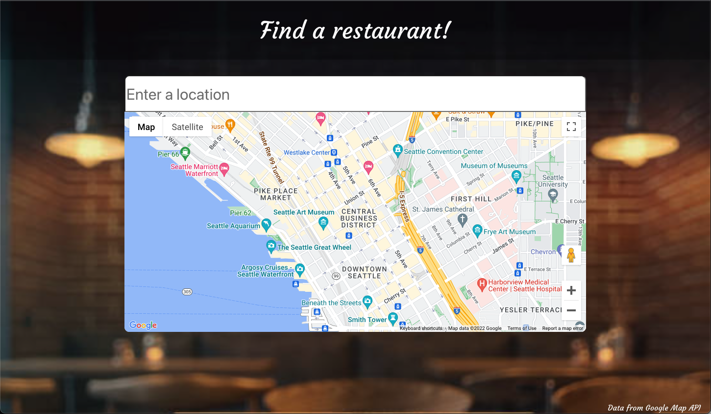
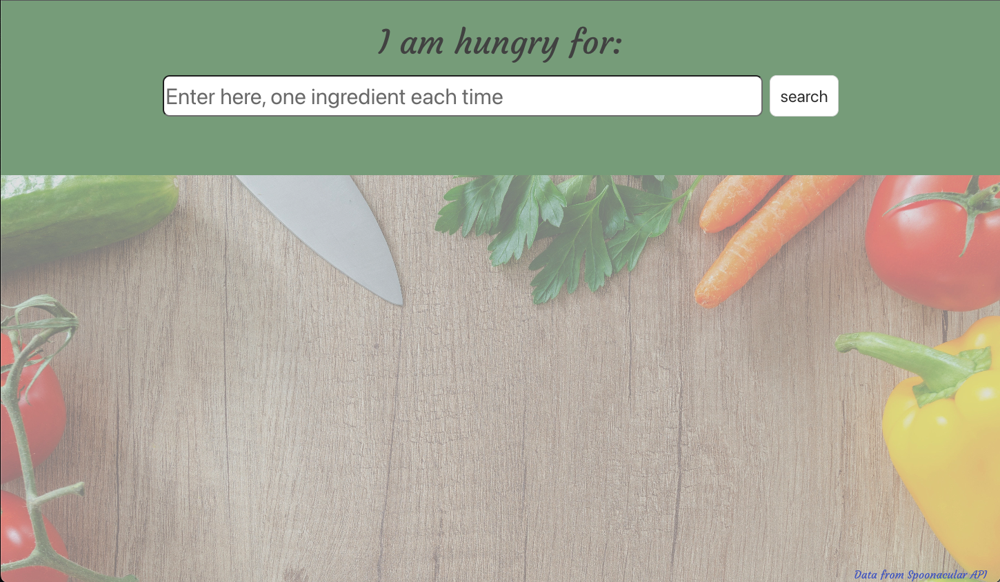

# wei-full
Title: Wei-Full

Decription
Helping the user decide weather they should stay home and cook or go out to eat.
The website gives users the option of "Staying in" or "go out!". With the use of api's we are able to give the user information from servers. When user selects "go out!", they are able to search using google places api a name or address of a place they want to go. When the user selects "Staying in", users are able to search up an ingredent and the user is presented with a few recipe options. 

How to use:
The homepage gives you a choice between weather the user would like to go out or stay in. Based on the users response they are sent to another page. 

When the user selects "go out!", the page takes them to a map. With the use of google places api the users are able to search by name or address they would like to go to. They are able to zoom in on the map to view the street. The address will be presented in the input box above the map. 

When the user selects "staying in" they are able to enter a single ingredient. The user is presented with 6 recipes that use that ingredient. When the user clicks on the box with the recipe they want to use they are taken to the recipe page on spoonacular. 

License 
MIT