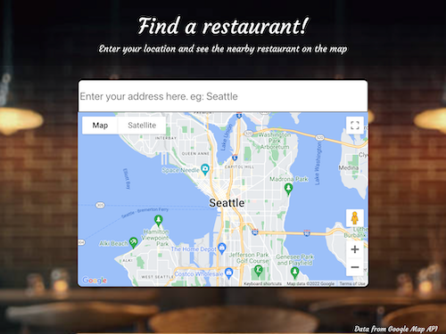
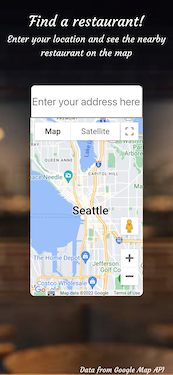
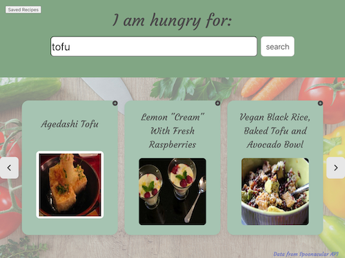
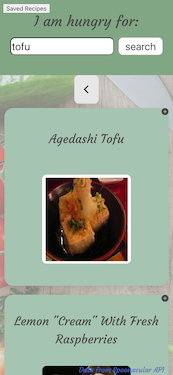

# wei-full

## Description

The website helps users decide what to have for dinner. It gives users the option of 'Stay in' or 'Go out'. When user selects 'Go out', they can enter their address and choose the restaurants nearby. When the user selects 'Stay in', users are able to search an ingredent and the user is presented with six recipe options. 

[Google Maps API](https://developers.google.com/maps) is used to retrieve map data. Recipe data is from [Spoonacular API](https://spoonacular.com/food-api).

View the deployed website: https://ruxinqu.github.io/wei-full/

## Table of Contents

- [Usage](#usage)
- [Credits](#credits)
- [Technologies Used](#technologies-used)
- [License](#license)

## Usage

* ### Go out:
1. The user can select 'Go out', and then enter the address. 
2. **Address autocomplete** is added to make the search easier.
3. Then nearby restaurants will show up with markers on top. Users can zoom in and click on the restaurant to view on Google map.
4. The animation below shows the web application's appearance and functionality on PC:

5. The screenshots below show the web application's appearance and functionality on tablet and mobile:

* ### Stay in:
1. The user are able to enter **one** ingredient. Then click on the '**Search**' button or press '**Enter**' can both trigger the search. 
2. If the recipe isn't found in the database, a **modal** will be issued.
3. Six recipe options of the ingredient will show up in two pages. Click on '>' can view the next page, and '<' to go back to the previous page.
4. Click on the recipe box then the user can be taken to the recipe page on spoonacular.
5. Click on the '+' at the top right corner of each recipe box, users can **save** the recipe to local storage.
6. Hover mouse over the dropdown list on the top left of the page, users can see all the saved recipe. Click on the list the user will be redirect to the recipe page on spoonacular.

7. The animation below shows the web application's appearance and functionality on PC:

8. The screenshots below show the web application's appearance and functionality on tablet and mobile:

## Credits
- [Dorian Birch](https://github.com/206Dorian)
- [Terry Huynh](https://github.com/TerryH23)
- [Haleigh Rzonca](https://github.com/Hrzonca)
- [Ruxin Qu](https://github.com/RuxinQu)

## Technologies Used
* [jQuery](https://jquery.com)
* [Bulma](https://bulma.io) 
* [Google Maps API](https://developers.google.com/maps)
* [Spoonacular API](https://spoonacular.com/food-api)

## License

This project is under MIT license

[https://www.gnu.org/licenses/gpl-3.0.txt](https://www.gnu.org/licenses/gpl-3.0.txt)

